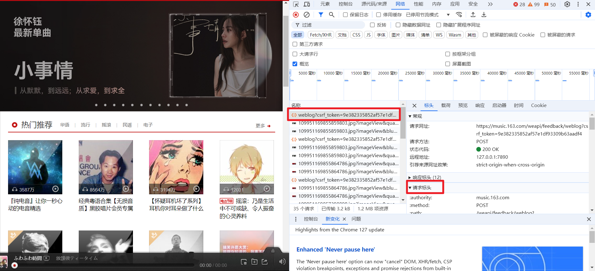

# ncm_key_classification
按照 Key 对网易云歌单进行分类

感谢 [dzzhang96](https://github.com/dzzhang96/ncm-playlist-sorter/tree/master) 提供的新建歌单的方法，感谢 [ncmbot](https://github.com/xiyouMc/ncmbot) 提供了丰富的接口。


## 简介

有一天我在网易云听歌，偶然听到了上下两首随机播放的歌曲，他们的 调性 居然是一模一样！当时就被爽到了。于是默默在心里对自己说，我一定要写出一个对歌单每一首歌曲的调性分类的程序。于是就有了它！ncm_key_classification


## Quick Start

安装环境

```
pip install -r ./requirements.txt
```

 接下来直接运行 `main.py`

```
python ./main.py
```

输入歌单 id，随后输入你想要分类的调性（大调还是小调）。

接下来登录网易云账号，就行啦！


## 获取歌单id

分享歌单，点击复制链接。


会得到这样的一串 url

```
https://music.163.com/playlist?id=xxxx&userid=xxxx
```

其中 `playlist?id=` 之后的那一串数字，就是歌单 id。


## 获取 Cookie

推荐使用 `Cookie` 登录，下面是获取 `Cookie` 的方法

用浏览器登录 网易云官网，接下来 按 `F12`。点击 网络。随便点开一个数据包。之后点击请求标头，复制里面的 `Cookie` 就行了




## 调性分类算法

参考 **Krumhansl-Schmuckler key-finding algorithm**

官网 [keycor Manpage for Humdrum Extras Tools](https://extras.humdrum.org/man/keycor/)

Github上的 [实现]([Krumhansl-Schmuckler key estimation · GitHub](https://gist.github.com/bmcfee/1f66825cef2eb34c839b42dddbad49fd))

一篇科普文章：[【音乐心理学】2 Perception of musical pitch - 知乎 (zhihu.com)](https://zhuanlan.zhihu.com/p/603975700)


计算步骤，参考[博客](https://blog.csdn.net/TruedickDing/article/details/106237499)：

1. 计算出音乐中12种不同音高的音符累计总时长，在此处的音高可以忽略八度的区分；
2. 选择一种调性特征权重，常用的有Krumhansl-Kessler、Aarden-Essen、Simple pitch、Bellman-Budge、Temperley-Kostka-Payne五种，每一种调性特征权重有各自的优劣，需要通过具体情况来选择；
3. 对音符累计总时长进行调整，将当前假设的主音排在列表的首位，与调性分析权重计算得到皮尔逊积矩相关系数，总共得到24个数值；
4. 通过argmax函数得到绝对值最大的皮尔逊积矩相关系数对应的调性，即为预测的调性


由于是对音符出现的时间进行统计，接下来再去看看属于哪一个音阶，所以不能直接区分大小调（例如 C 与 Am 它们有相同的音阶）。但是单独在大调或者小调中分析还是很准确的。

